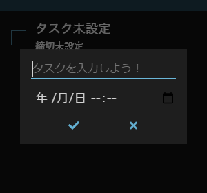

# ToDo Always

## このアプリは何？

デスクトップに常駐させられる ToDo アプリです。

- 残り時間が表示される
- 超過時間も表示される
- デスクトップに最前面で置いておける

という、締め切りを忘れがちの人間にはとても嬉しい機能を詰め込んでます！

## スクリーンショット

## 使い方

### タスク操作

#### 追加

#### 編集

#### 削除

#### 完了ステータス変更

### アプリ操作

#### 最小化

#### 終了

#### 再表示

## カスタマイズ

実行ファイルと同じ場所にある `config.json` を編集することで、表示をカスタマイズすることができます。
パラメータは以下の通りです。

- `hideDeletedTask`: 削除されたタスクを非表示にするかどうか (初期値: `true`)
- `hideDoneTask`: 完了したタスクを非表示にするかどうか (初期値: `false`)
- `sortByDeadline`: 締め切り日時の昇順で並び替えるかどうか (初期値: `true`)
- `sortByStatus`: 未完了タスク→完了タスク の順で並び替えるかどうか (初期値: `true`)
- `appearances`: 見た目に関する設定
  - `main.background.color`: アプリ背景のRGB値 (初期値: `16, 16, 16`)
  - `main.background.alpha`: アプリ背景の不透明度 (初期値: `0.9`)
  - `main.foreground.color`: メインの文字のRGB値 (初期値: `255, 255, 255`)
  - `main.foreground.alpha`: メインの文字の不透明度 (初期値: `0.8`)
  - `quiet.foreground.color`: 完了したタスクなどの文字のRGB値 (初期値: `255, 255, 255`)
  - `quiet.foreground.alpha`: 完了したタスクなどの文字の不透明度 (初期値: `0.3`)
  - `highlighted.foreground.color`: 締切超過タスクの文字のRGB値 (初期値: `255, 32, 32`)
  - `highlighted.foreground.alpha`: 締切超過タスクの文字の不透明度 (初期値: `0.9`)
  - `modal.background.color`: モーダルウィンドウ背景のRGB値 (初期値: `32, 32, 32`)
  - `modal.background.alpha`: モーダルウィンドウ背景の不透明度 (初期値: `0.9`)
  - `theme.color`: テーマカラーRGB値 (初期値: `108, 192, 228`)
  - `theme.alpha`: テーマカラー不透明度 (初期値: `0.8`)
  - `bar.background.color`: タイトルバー背景のRGB値 (初期値: `32, 64, 80`)
  - `bar.background.alpha`: タイトルバー背景の不透明度 (初期値: `0.9`)
  - `bar.foreground.color`: タイトルバー上のボタンのRGB値 (初期値: `255, 255, 255`)
  - `bar.foreground.alpha`: タイトルバー上のボタンの不透明度 (初期値: `0.5`)
- `localize`: 
  - `taskNamePlaceholder`: タスク名入力欄のプレースホルダー (初期値: `タスクを入力しよう！`)
  - `taskNameNotSet`: タスクの名前が設定されていない時に代わりに表示される文字列 (初期値: `タスク未設定`)
  - `deadlineNotSet`: タスクの締切が設定されていない時に代わりに表示される文字列 (初期値: `締切なし`)
  - `dateFormat`: 締切のフォーマット 詳細は[こちら](https://day.js.org/docs/en/display/format)を参照 (初期値: `M/D(dd) HH:mm`)
  - `day`: 日の単位 (初期値: `日`)
  - `hour`: 時間の単位 (初期値: `時間`)
  - `min`: 分の単位 (初期値: `分`)
  - `sec`: 秒の単位 (初期値: `秒`)
  - `remainingFormat`: 残り時間表示のフォーマット `%s`の部分が残り時間に置換される (初期値: `あと %s`)
  - `overFormat`: 超過時間表示のフォーマット `%s`の部分が超過時間に置換される (初期値: `%s 超過`)

## ビルド

`npm run electron:build`

## 更新履歴

### 1.1.0 (2021/2/18)

- タイトルバーにピン留め、最小化、閉じるボタンを追加
- アプリ終了時のウィンドウサイズ、位置を保存する機能を追加
- 締め切り日時に曜日が表示されるように変更
- 完了済みのタスクが下部に移動するように変更
- `config.json` により色や並び替えの設定ができるように変更
- タスク編集画面のカレンダーマークの色を変更

### 1.0.0 (2021/2/17)

- 公開
