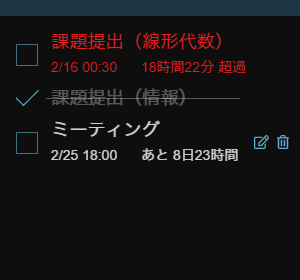

# ToDo Always

デスクトップに常駐させられる ToDo アプリです。

- タスク内容
- 完了/未完のチェックボックス
- 締め切り日時
- 残り日数 / 超過日数

のみのシンプル仕様！

## スクリーンショット

## 使い方

## ビルド

`npm run electron:build`

## 更新履歴

### 1.1.0 (2021/2/18)

- 締め切り日時に曜日が表示されるように変更
- 完了済みのタスクが下部に移動するように変更
- タイトルバーにピン留め、最小化、閉じるボタンを追加
- `config.json` により色や並び替えの設定ができるように変更
- タスク編集画面のカレンダーマークの色を変更

### 1.0.0 (2021/2/17)

- 公開
